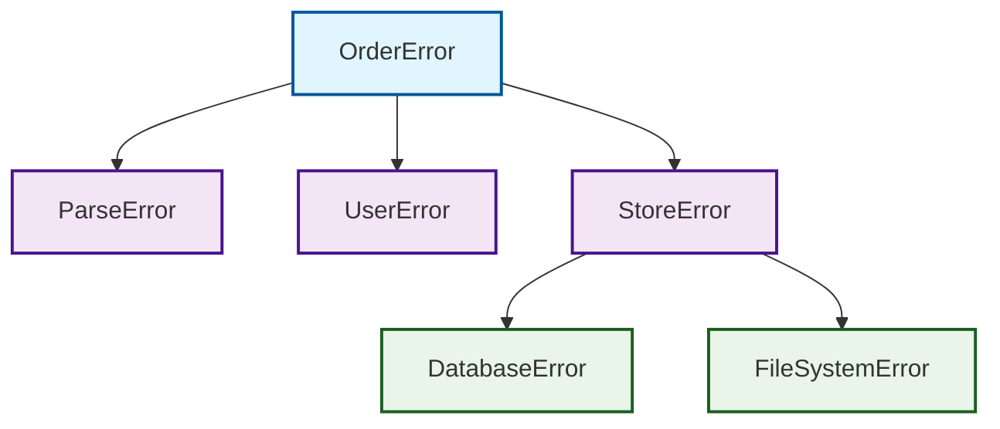

# 错误分类体系

## 概述

错误分类是错误处理系统的基础，通过系统化的分类方法，可以更好地理解错误的性质、来源和处理策略。本系统采用多维度分类方法，从错误性质和层级两个维度进行分类。

## 按错误性质分类

根据错误的根本性质和触发原因，将错误分为四大类：

### 业务错误 (Business Error)

| 属性 | 描述 |
|------|------|
| **特征** | 由业务规则触发的明确错误 |
| **触发条件** | 违反业务逻辑规则 |
| **示例** | 余额不足、订单格式错误、用户权限不足 |
| **处理策略** | 直接返回客户端，提供明确的错误信息 |
| **严重程度** | 低 - 正常业务流程的一部分 |

### 系统错误 (System Error)

| 属性 | 描述 |
|------|------|
| **特征** | 系统内部状态异常 |
| **触发条件** | 系统资源不足或内部故障 |
| **示例** | 数据库连接失败、内存不足、磁盘空间不足 |
| **处理策略** | 告警并降级处理，确保服务可用性 |
| **严重程度** | 高 - 影响系统稳定性 |

### 依赖错误 (Dependency Error)

| 属性 | 描述 |
|------|------|
| **特征** | 第三方服务或基础设施错误 |
| **触发条件** | 外部依赖服务不可用或响应异常 |
| **示例** | 支付网关超时、短信服务不可用、外部API调用失败 |
| **处理策略** | 重试机制，必要时降级处理 |
| **严重程度** | 中 - 临时性故障 |

### 逻辑错误 (Logic Error)

| 属性 | 描述 |
|------|------|
| **特征** | 程序逻辑缺陷导致的不可恢复错误 |
| **触发条件** | 代码逻辑错误或边界条件处理不当 |
| **示例** | 空指针异常、数组越界、类型转换失败 |
| **处理策略** | 立即终止，避免数据不一致 |
| **严重程度** | 严重 - 需要紧急修复 |

### 分类对比表

| 类型 | 特征 | 示例 | 处理策略 | 可恢复性 |
|------|------|------|----------|----------|
| **业务错误** | 由业务规则触发的明确错误 | 余额不足、订单格式错误 | 直接返回客户端 | 是 |
| **系统错误** | 系统内部状态异常 | 数据库连接失败、内存不足 | 告警并降级处理 | 部分 |
| **依赖错误** | 第三方服务或基础设施错误 | 支付网关超时 | 重试机制 | 通常可恢复 |
| **逻辑错误** | 程序逻辑缺陷导致的不可恢复错误 | 空指针异常 | 立即终止 | 否 |

## 按错误层级分类

错误按照发生的系统层级进行分类，形成层次化的错误体系。这种分类方法有助于理解错误的传播路径和影响范围。

### 错误层级关系图



### 层级说明

#### 顶层错误 (Top Level)
- **OrderError**: 订单相关的顶层错误
- **职责**: 统一所有订单处理过程中的错误
- **特点**: 向外部API暴露的主要错误类型

#### 中层错误 (Middle Level)
- **ParseError**: 解析层错误
  - 订单数据格式错误、字段验证失败
- **UserError**: 用户层错误  
  - 用户权限不足、用户状态异常
- **StoreError**: 存储层错误
  - 数据持久化相关错误的聚合

#### 底层错误 (Bottom Level)
- **DatabaseError**: 数据库错误
  - 连接失败、查询超时、约束冲突
- **FileSystemError**: 文件系统错误
  - 文件不存在、权限不足、磁盘空间不足

## 错误编码规范

### 编码结构

错误编码采用分层结构，便于快速定位错误类型：

```
格式: [业务域].[错误大类].[错误子类].[具体错误]

示例:
- ORDER.BUSINESS.INSUFFICIENT_BALANCE  // 订单业务错误-余额不足
- ORDER.SYSTEM.DATABASE_CONNECTION     // 订单系统错误-数据库连接失败
- ORDER.DEPENDENCY.PAYMENT_TIMEOUT     // 订单依赖错误-支付超时
- ORDER.LOGIC.NULL_POINTER            // 订单逻辑错误-空指针
```

### 错误等级映射

| 等级 | 代码范围 | 严重程度 | 处理优先级 |
|------|----------|----------|------------|
| CRITICAL | 100-199 | 严重 | 立即处理 |
| HIGH | 200-299 | 高 | 1小时内处理 |
| MEDIUM | 300-399 | 中 | 4小时内处理 |
| LOW | 400-499 | 低 | 24小时内处理 |
| INFO | 500-599 | 信息 | 记录即可 |

## 使用建议

### 错误分类最佳实践

1. **明确区分**: 确保每个错误都有明确的分类归属
2. **避免歧义**: 同一个错误不应同时属于多个分类
3. **层级清晰**: 错误层级关系要符合系统架构
4. **扩展友好**: 预留扩展空间，便于新增错误类型

### 错误处理优先级

根据错误分类制定处理优先级：

1. **逻辑错误**: 最高优先级，需要立即修复
2. **系统错误**: 高优先级，需要快速响应
3. **依赖错误**: 中优先级，需要有重试和降级策略
4. **业务错误**: 低优先级，正常业务流程的一部分

## 相关文档

- [错误处理策略](./02-handling-strategies.md) - 不同类型错误的处理策略
- [错误归集机制](./03-error-aggregation.md) - 跨层错误转换方法
- [错误处理层级](./04-handling-layers.md) - 分层处理模型