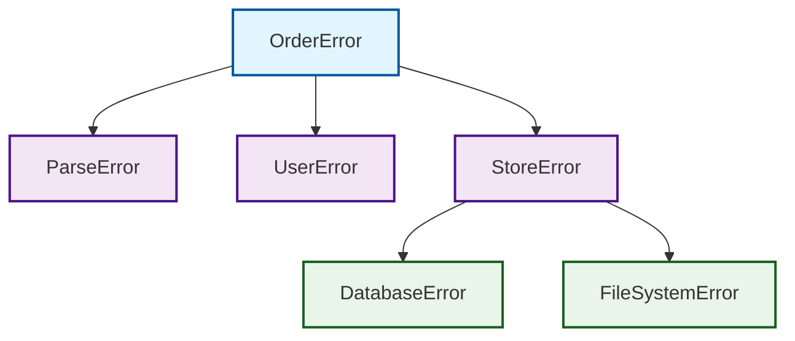

# 错误分类体系

## 概述

错误分类是错误处理系统的基础，通过系统化的分类方法，可以更好地理解错误的性质、来源和处理策略。本系统采用分层架构的错误分类方法，将错误按照系统层级分为三大类，每类错误都有明确的错误代码范围和处理策略。

## 错误分层架构

根据错误发生的系统层级，将错误分为三大类：

### 业务层错误 (Business Layer Errors) - 代码范围 100-199

| 属性 | 描述 |
|------|------|
| **特征** | 用户-facing错误，在正常操作中预期发生 |
| **触发条件** | 输入验证失败、业务规则违反、资源不存在、权限不足 |
| **包含类型** | ValidationError、BusinessError、NotFoundError、PermissionError |
| **处理策略** | 直接返回客户端，提供明确的错误信息 |
| **严重程度** | 低 - 正常业务流程的一部分 |

### 基础设施层错误 (Infrastructure Layer Errors) - 代码范围 200-299

| 属性 | 描述 |
|------|------|
| **特征** | 系统级故障，应该很少发生 |
| **触发条件** | 数据库操作失败、文件系统错误、网络连接问题、资源耗尽、操作超时 |
| **包含类型** | DataError、SystemError、NetworkError、ResourceError、TimeoutError |
| **处理策略** | 告警并降级处理，确保服务可用性 |
| **严重程度** | 高 - 影响系统稳定性 |

### 配置和外部层错误 (Configuration & External Layer Errors) - 代码范围 300-399

| 属性 | 描述 |
|------|------|
| **特征** | 环境和第三方服务问题 |
| **触发条件** | 配置错误、第三方服务不可用、程序逻辑缺陷 |
| **包含类型** | ConfigError、ExternalError、LogicError |
| **处理策略** | 配置错误需要修复，外部错误需要重试或降级，逻辑错误需要立即修复 |
| **严重程度** | 中到严重 - 取决于具体类型 |

### 详细错误类型分类

#### 业务层错误详细分类

**ValidationError (验证错误)**
- **错误代码**: 100-199
- **描述**: 格式错误、参数校验失败等
- **示例**: 用户输入格式不正确、必填字段缺失、数据类型不匹配
- **处理策略**: 返回具体的验证失败信息给用户

**BusinessError (业务逻辑错误)**
- **错误代码**: 100-199
- **描述**: 业务规则违反、状态冲突等
- **示例**: 余额不足、订单状态冲突、业务流程违规
- **处理策略**: 返回业务规则违反信息，指导用户正确操作

**NotFoundError (资源不存在错误)**
- **错误代码**: 100-199
- **描述**: 查询的资源不存在
- **示例**: 用户不存在、订单不存在、商品已下架
- **处理策略**: 返回资源不存在的明确信息

**PermissionError (权限错误)**
- **错误代码**: 100-199
- **描述**: 权限不足、认证失败
- **示例**: 用户无权访问、操作权限不足、会话过期
- **处理策略**: 返回权限错误信息，引导用户重新认证

#### 基础设施层错误详细分类

**DataError (数据错误)**
- **错误代码**: 200-299
- **描述**: 数据库操作、数据格式错误
- **示例**: 数据库连接失败、查询超时、约束冲突、数据格式错误
- **处理策略**: 记录详细错误信息，必要时重试或降级

**SystemError (系统错误)**
- **错误代码**: 200-299
- **描述**: 文件系统、操作系统错误
- **示例**: 文件不存在、权限不足、磁盘空间不足、系统调用失败
- **处理策略**: 系统级告警，检查系统资源状态

**NetworkError (网络错误)**
- **错误代码**: 200-299
- **描述**: 网络连接、HTTP请求错误
- **示例**: 网络连接超时、DNS解析失败、HTTP请求失败
- **处理策略**: 重试机制，必要时降级处理

**ResourceError (资源错误)**
- **错误代码**: 200-299
- **描述**: 内存不足、磁盘空间不足等
- **示例**: 内存分配失败、磁盘空间不足、文件句柄耗尽
- **处理策略**: 系统资源监控，必要时重启服务

**TimeoutError (超时错误)**
- **错误代码**: 200-299
- **描述**: 操作超时
- **示例**: 数据库查询超时、网络请求超时、处理超时
- **处理策略**: 超时重试，优化性能或增加超时时间

#### 配置和外部层错误详细分类

**ConfigError (配置错误)**
- **错误代码**: 300-399
- **描述**: 配置相关错误
- **子类型**: Core(核心配置)、Feature(功能配置)、Dynamic(动态配置)
- **示例**: 配置文件缺失、配置项错误、配置格式不正确
- **处理策略**: 检查并修复配置文件，必要时重启服务

**ExternalError (外部服务错误)**
- **错误代码**: 300-399
- **描述**: 第三方服务错误
- **示例**: 支付网关故障、短信服务不可用、外部API调用失败
- **处理策略**: 重试机制，降级处理，监控第三方服务状态

**LogicError (逻辑错误)**
- **错误代码**: 300-399
- **描述**: 程序逻辑缺陷
- **示例**: 空指针异常、数组越界、类型转换失败、算法错误
- **处理策略**: 立即修复代码，发布补丁

### 分类对比表

| 层级 | 错误类型 | 代码范围 | 特征 | 示例 | 处理策略 | 可恢复性 |
|------|----------|----------|------|------|----------|----------|
| **业务层** | ValidationError | 100-199 | 输入验证失败 | 格式错误、参数校验 | 返回客户端信息 | 是 |
| **业务层** | BusinessError | 100-199 | 业务规则违反 | 余额不足、状态冲突 | 返回业务规则信息 | 是 |
| **业务层** | NotFoundError | 100-199 | 资源不存在 | 用户不存在、订单不存在 | 返回不存在信息 | 是 |
| **业务层** | PermissionError | 100-199 | 权限不足 | 无权访问、认证失败 | 返回权限错误 | 是 |
| **基础设施层** | DataError | 200-299 | 数据库操作失败 | 连接失败、查询超时 | 重试或降级 | 通常可恢复 |
| **基础设施层** | SystemError | 200-299 | 系统内部故障 | 文件系统错误、磁盘空间不足 | 系统告警 | 部分 |
| **基础设施层** | NetworkError | 200-299 | 网络连接问题 | 网络超时、HTTP请求失败 | 重试机制 | 通常可恢复 |
| **基础设施层** | ResourceError | 200-299 | 资源耗尽 | 内存不足、文件句柄耗尽 | 系统监控 | 部分 |
| **基础设施层** | TimeoutError | 200-299 | 操作超时 | 查询超时、请求超时 | 超时重试 | 通常可恢复 |
| **配置和外部层** | ConfigError | 300-399 | 配置问题 | 配置文件错误、配置项缺失 | 修复配置 | 是 |
| **配置和外部层** | ExternalError | 300-399 | 第三方服务 | 支付网关故障、外部API失败 | 重试降级 | 通常可恢复 |
| **配置和外部层** | LogicError | 300-399 | 程序逻辑缺陷 | 空指针、数组越界 | 立即修复 | 否 |

## 按错误层级分类

错误按照发生的系统层级进行分类，形成层次化的错误体系。这种分类方法有助于理解错误的传播路径和影响范围。

### 错误层级关系图



### 层级说明

#### 顶层错误 (Top Level)
- **OrderError**: 订单相关的顶层错误
- **职责**: 统一所有订单处理过程中的错误
- **特点**: 向外部API暴露的主要错误类型

#### 中层错误 (Middle Level)
- **ParseError**: 解析层错误
  - 订单数据格式错误、字段验证失败
- **UserError**: 用户层错误  
  - 用户权限不足、用户状态异常
- **StoreError**: 存储层错误
  - 数据持久化相关错误的聚合

#### 底层错误 (Bottom Level)
- **DatabaseError**: 数据库错误
  - 连接失败、查询超时、约束冲突
- **FileSystemError**: 文件系统错误
  - 文件不存在、权限不足、磁盘空间不足

## 错误编码规范

### 编码格式

错误编码采用数字编码格式，按照系统层级分配代码范围：

- **业务层错误**: 100-199
- **基础设施层错误**: 200-299  
- **配置和外部层错误**: 300-399

### 编码示例

根据代码中的UvsReason枚举实现，具体错误编码示例：

| 错误类型 | 代码范围 | 示例编码 | 说明 |
|----------|----------|----------|------|
| ValidationError | 100-199 | 101 | 用户输入格式错误 |
| BusinessError | 100-199 | 102 | 余额不足错误 |
| NotFoundError | 100-199 | 103 | 资源不存在错误 |
| PermissionError | 100-199 | 104 | 权限不足错误 |
| DataError | 200-299 | 201 | 数据库连接失败 |
| SystemError | 200-299 | 202 | 文件系统错误 |
| NetworkError | 200-299 | 203 | 网络连接超时 |
| ResourceError | 200-299 | 204 | 内存不足错误 |
| TimeoutError | 200-299 | 205 | 操作超时错误 |
| ConfigError | 300-399 | 301 | 配置文件错误 |
| ExternalError | 300-399 | 302 | 第三方服务错误 |
| LogicError | 300-399 | 303 | 程序逻辑错误 |

### 配置错误子分类编码

ConfigError进一步细分为子类型，每个子类型有特定的代码范围：

| 配置错误类型 | 代码范围 | 说明 |
|--------------|----------|------|
| Core | 300-319 | 核心配置错误 |
| Feature | 320-339 | 功能配置错误 |
| Dynamic | 340-359 | 动态配置错误 |

### 编码规则

1. **层级优先**: 错误代码首先按系统层级分配范围
2. **类型细分**: 在每个层级内，按错误类型细分代码
3. **扩展性**: 为每种错误类型预留足够的代码空间
4. **一致性**: 保持错误编码的全局唯一性和一致性

## 错误处理策略

### 策略枚举定义

根据代码中的ErrStrategy枚举，系统支持三种错误处理策略：

```rust
pub enum ErrStrategy {
    Retry,    // 重试策略
    Ignore,   // 忽略策略
    Throw,    // 抛出策略
}
```

### 策略选择原则

根据错误类型和层级，选择合适的处理策略：

| 错误层级 | 错误类型 | 默认策略 | 可选策略 | 选择依据 |
|----------|----------|----------|----------|----------|
| 业务层 | ValidationError | Throw | Ignore | 需要用户知晓并修正 |
| 业务层 | BusinessError | Throw | Ignore | 业务规则违反，需要用户处理 |
| 业务层 | NotFoundError | Throw | Ignore | 资源不存在，需要用户确认 |
| 业务层 | PermissionError | Throw | Ignore | 权限不足，需要用户重新认证 |
| 基础设施层 | DataError | Retry | Throw | 临时性数据库故障，可重试 |
| 基础设施层 | SystemError | Throw | Ignore | 系统级故障，通常需要人工干预 |
| 基础设施层 | NetworkError | Retry | Throw | 网络临时故障，可重试 |
| 基础设施层 | ResourceError | Throw | Ignore | 资源耗尽，需要系统级处理 |
| 基础设施层 | TimeoutError | Retry | Throw | 操作超时，可重试 |
| 配置和外部层 | ConfigError | Throw | Ignore | 配置错误，需要修复配置 |
| 配置和外部层 | ExternalError | Retry | Throw | 外部服务故障，可重试 |
| 配置和外部层 | LogicError | Throw | Ignore | 程序逻辑缺陷，需要立即修复 |

### 策略实施指南

#### 1. 重试策略 (Retry)

**适用场景**:
- 临时性网络故障
- 数据库连接超时
- 第三方服务临时不可用
- 资源临时不可用

**实施要点**:
- 设置最大重试次数
- 使用指数退避算法
- 记录重试日志
- 避免无限重试

**代码示例**:
```rust
// 使用ErrStrategy::Retry处理可重试错误
let result = operation().map_err(|e| {
    if is_retryable_error(&e) {
        StructError::new(e.reason(), ErrStrategy::Retry)
    } else {
        StructError::new(e.reason(), ErrStrategy::Throw)
    }
});
```

#### 2. 忽略策略 (Ignore)

**适用场景**:
- 非关键功能的验证错误
- 可选功能的失败
- 日志记录失败
- 监控数据上报失败

**实施要点**:
- 记录忽略的错误日志
- 确保不影响核心功能
- 定期审查被忽略的错误

**代码示例**:
```rust
// 使用ErrStrategy::Ignore处理可忽略错误
let _ = optional_operation().map_err(|e| {
    StructError::new(e.reason(), ErrStrategy::Ignore)
});
```

#### 3. 抛出策略 (Throw)

**适用场景**:
- 关键业务逻辑错误
- 权限验证失败
- 配置错误
- 程序逻辑缺陷

**实施要点**:
- 提供清晰的错误信息
- 包含足够的上下文
- 确保错误能正确传播

**代码示例**:
```rust
// 使用ErrStrategy::Throw处理必须抛出的错误
let result = critical_operation().map_err(|e| {
    StructError::new(e.reason(), ErrStrategy::Throw)
});
```

## 使用建议

### 错误定义最佳实践

1. **选择正确的错误类型**
   - 根据错误发生的层级选择合适的错误类型
   - 遵循错误代码范围规范
   - 保持错误分类的一致性

2. **提供详细的错误信息**
   - 使用OperationContext提供丰富的上下文信息
   - 包含错误发生的位置、原因和详细信息
   - 便于问题诊断和修复

3. **合理设置处理策略**
   - 根据错误的性质选择合适的ErrStrategy
   - 为可重试错误设置重试策略
   - 为关键错误设置抛出策略

### 错误处理最佳实践

1. **使用StructError进行错误包装**
   ```rust
   // 使用StructError包装底层错误
   let result = database_operation().map_err(|e| {
       StructError::new(
           UvsReason::DataError("Database connection failed".to_string()),
           ErrStrategy::Retry
       )
   });
   ```

2. **利用OperationContext管理上下文**
   ```rust
   // 使用OperationContext添加上下文信息
   let context = OperationContext::new("user_service")
       .with("user_id", "12345")
       .with("operation", "update_profile");
   
   let result = operation().map_err(|e| {
       StructError::with_context(e.reason(), ErrStrategy::Throw, context)
   });
   ```

3. **实现From trait进行错误转换**
   ```rust
   // 为自定义错误类型实现From trait
   impl From<DatabaseError> for StructError<UvsReason> {
       fn from(err: DatabaseError) -> Self {
           StructError::new(
               UvsReason::DataError(format!("Database error: {}", err)),
               ErrStrategy::Retry
           )
       }
   }
   ```

### 错误恢复最佳实践

1. **实现自动重试机制**
   - 为网络操作、数据库操作等实现自动重试
   - 使用指数退避算法避免雪崩效应
   - 设置最大重试次数和超时时间

2. **提供降级方案**
   - 为非核心功能提供降级方案
   - 在第三方服务不可用时提供替代功能
   - 确保系统核心功能可用

3. **监控和告警**
   - 对系统错误进行监控和告警
   - 跟踪错误率和重试成功率
   - 及时发现和处理系统问题

## 相关文档

- [错误处理策略](./02-handling-strategies.md) - 不同类型错误的处理策略
- [错误归集机制](./03-error-aggregation.md) - 跨层错误转换方法
- [错误处理层级](./04-handling-layers.md) - 分层处理模型