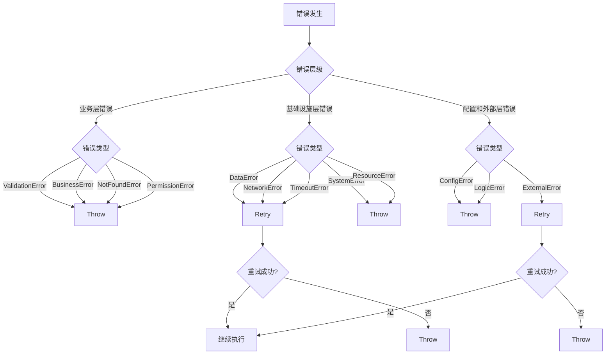
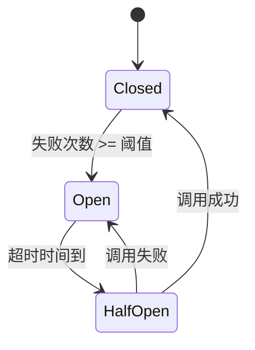

# 错误处理策略

## 概述

错误处理策略是错误处理系统的核心，它定义了如何对不同类型的错误进行响应和处理。根据代码中的`ErrStrategy`枚举，本系统提供了三种主要的错误处理策略：Retry（重试）、Ignore（忽略）和Throw（抛出）。每种策略都有其适用场景和实现方式。

## 策略概览

### 策略矩阵

| 策略类型 | 适用错误类型 | 恢复方式 | 性能影响 | 实现复杂度 |
|----------|--------------|----------|----------|------------|
| Throw | 业务错误、逻辑错误、配置错误 | 需要用户干预 | 低 | 低 |
| Retry | 数据错误、网络错误、超时错误、外部错误 | 自动恢复 | 中 | 中 |
| Ignore | 非关键验证错误、可选功能失败 | 自动忽略 | 低 | 低 |

### ErrStrategy 枚举定义

```rust
pub enum ErrStrategy {
    Retry,    // 重试策略：适用于临时性故障
    Ignore,   // 忽略策略：适用于非关键错误
    Throw,    // 抛出策略：适用于需要立即处理的错误
}
```

### 策略选择流程图



## 策略详解

### 1. 向上抛出 (Throw Up)

#### 适用场景
- 当前层级不具备处理该错误的能力
- 错误需要由上层业务逻辑处理
- 需要保留原始错误信息的同时转换错误类型

#### 实现方式
```rust
// 使用 ErrConv trait 进行错误类型转换
impl From<StoreReason> for StructReason<OrderReason> {
    fn from(value: StoreReason) -> Self {
        match value {
            StoreReason::StorageFull => 
                StructReason::from(UvsReason::from_sys("storage full")),
            StoreReason::ConnectionFailed => 
                StructReason::from(UvsReason::from_dep("db unavailable")),
            StoreReason::ConstraintViolation => 
                StructReason::from(UvsReason::from_biz("data conflict")),
        }
    }
}

// 使用示例
fn process_order(order: Order) -> Result<OrderResponse, OrderError> {
    save_to_database(&order)
        .map_err(|e| OrderError::from(e))  // 数据库错误转换为业务错误
        .and_then(|_| validate_order(&order))
        .map_err(|e| OrderError::from(e))  // 验证错误转换为业务错误
}
```

#### 最佳实践
- **保留原始信息**: 转换时保留原始错误的详细信息
- **语义转换**: 确保转换后的错误类型在业务语义上准确
- **链式追踪**: 维护错误转换的调用链，便于调试

### 2. 重试 (Retry)

#### 适用场景
- 网络超时等临时性故障
- 资源竞争导致的偶发失败
- 外部服务的瞬时不可用

#### 实现方式
```rust
use std::time::Duration;
use backoff::ExponentialBackoff;

// 基础重试机制
pub fn with_retry<F, T, E>(mut operation: F, max_retries: usize) -> Result<T, E>
where
    F: FnMut() -> Result<T, E>,
    E: std::fmt::Debug,
{
    let mut last_error = None;
    
    for attempt in 0..max_retries {
        match operation() {
            Ok(result) => return Ok(result),
            Err(e) => {
                last_error = Some(e);
                if attempt < max_retries - 1 {
                    std::thread::sleep(Duration::from_millis(100 * (attempt + 1)));
                }
            }
        }
    }
    
    Err(last_error.unwrap())
}

// 高级重试宏
retry!(
    max_retries = 3,
    backoff = Exponential::new(Duration::from_secs(1)),
    condition = |e: &OrderError| e.is_retryable()
) {
    Self::place_order(user_id, amount, order_txt)
}
```

#### 重试策略配置

| 参数 | 建议值 | 说明 |
|------|--------|------|
| **最大重试次数** | 3 | 避免无限重试 |
| **初始延迟** | 1s | 给系统恢复时间 |
| **退避算法** | 指数退避 | 避免雪崩效应 |
| **最大延迟** | 30s | 控制最大等待时间 |

#### 可重试错误判断
```rust
impl OrderError {
    pub fn is_retryable(&self) -> bool {
        matches!(
            self,
            OrderError::DatabaseTimeout(_)
                | OrderError::NetworkError(_)
                | OrderError::ResourceBusy(_)
        )
    }
    
    pub fn is_non_retryable(&self) -> bool {
        matches!(
            self,
            OrderError::InvalidInput(_)
                | OrderError::InsufficientBalance(_)
                | OrderError::PermissionDenied(_)
        )
    }
}
```

### 3. 降级 (Degradation)

#### 适用场景
- 非核心功能失败
- 高负载情况下的性能保护
- 外部依赖不可用时的功能简化

#### 实现方式
```rust
// 服务降级模式
pub trait DegradeableService {
    type Output;
    type FallbackOutput;
    
    fn execute(&self) -> Result<Self::Output, ServiceError>;
    fn fallback(&self) -> Result<Self::FallbackOutput, ServiceError>;
    
    fn execute_with_degradation(&self) -> Result<Either<Self::Output, Self::FallbackOutput>, ServiceError> {
        match self.execute() {
            Ok(output) => Ok(Either::Left(output)),
            Err(e) if e.should_degrade() => {
                log::warn!("Service degraded: {:?}", e);
                self.fallback().map(Either::Right)
            }
            Err(e) => Err(e),
        }
    }
}

// 推荐服务降级示例
impl RecommendationService {
    pub fn get_recommendations(&self, user_id: &str) -> Result<Vec<Product>, ServiceError> {
        self.recommendation_client
            .get_recommendations(user_id)
            .or_else(|e| {
                log::warn!("Recommendation service failed, falling back to popular items: {:?}", e);
                self.get_popular_items()  // 降级到热门商品
            })
    }
    
    fn get_popular_items(&self) -> Result<Vec<Product>, ServiceError> {
        // 从缓存或数据库获取热门商品
        Ok(vec![])  // 简化实现
    }
}
```

#### 降级策略类型

| 降级类型 | 触发条件 | 降级方案 | 影响范围 |
|----------|----------|----------|----------|
| **功能降级** | 服务不可用 | 关闭非核心功能 | 特定功能不可用 |
| **数据降级** | 数据源异常 | 使用缓存或默认数据 | 数据可能不准确 |
| **性能降级** | 系统负载高 | 降低精度或频率 | 响应质量下降 |
| **体验降级** | 资源不足 | 简化UI或交互 | 用户体验下降 |

### 4. 熔断 (Circuit Breaker)

#### 适用场景
- 外部依赖持续失败
- 防止级联故障
- 保护系统稳定性

#### 实现方式
```rust
use std::time::{Duration, Instant};
use std::sync::atomic::{AtomicUsize, Ordering};
use std::sync::Arc;

pub struct CircuitBreaker {
    failure_count: AtomicUsize,
    last_failure_time: Arc<AtomicUsize>,
    max_failures: usize,
    timeout: Duration,
    state: Arc<AtomicUsize>, // 0: Closed, 1: Open, 2: HalfOpen
}

impl CircuitBreaker {
    pub fn new(max_failures: usize, timeout: Duration) -> Self {
        Self {
            failure_count: AtomicUsize::new(0),
            last_failure_time: Arc::new(AtomicUsize::new(0)),
            max_failures,
            timeout,
            state: Arc::new(AtomicUsize::new(0)), // Initially closed
        }
    }
    
    pub fn execute<F, T, E>(&self, operation: F) -> Result<T, E>
    where
        F: FnOnce() -> Result<T, E>,
    {
        if self.is_open() {
            return Err("Circuit breaker is open".into());
        }
        
        match operation() {
            Ok(result) => {
                self.on_success();
                Ok(result)
            }
            Err(e) => {
                self.on_failure();
                Err(e)
            }
        }
    }
    
    fn is_open(&self) -> bool {
        let state = self.state.load(Ordering::Relaxed);
        if state == 1 { // Open
            let last_failure = self.last_failure_time.load(Ordering::Relaxed);
            let elapsed = Instant::now().duration_since(Instant::from_nanos(last_failure as u64));
            if elapsed > self.timeout {
                self.state.store(2, Ordering::Relaxed); // HalfOpen
                false
            } else {
                true
            }
        } else {
            false
        }
    }
    
    fn on_success(&self) {
        self.failure_count.store(0, Ordering::Relaxed);
        self.state.store(0, Ordering::Relaxed); // Closed
    }
    
    fn on_failure(&self) {
        let count = self.failure_count.fetch_add(1, Ordering::Relaxed) + 1;
        self.last_failure_time.store(
            Instant::now().duration_since(Instant::UNIX_EPOCH).as_nanos() as usize,
            Ordering::Relaxed
        );
        
        if count >= self.max_failures {
            self.state.store(1, Ordering::Relaxed); // Open
        }
    }
}

// 支付服务熔断示例
impl PaymentService {
    pub fn process_payment(&self, request: PaymentRequest) -> Result<PaymentResponse, PaymentError> {
        self.circuit_breaker.execute(|| {
            self.payment_gateway.process(request)
        })
    }
}
```

#### 熔断器状态转换



#### 熔断器配置参数

| 参数 | 默认值 | 说明 | 调整建议 |
|------|--------|------|----------|
| **失败阈值** | 5 | 触发熔断的失败次数 | 根据服务重要性调整 |
| **熔断超时** | 60s | 熔断状态的持续时间 | 根据服务恢复能力调整 |
| **半开状态请求数** | 1 | 半开状态下的测试请求数 | 避免雪崩效应 |
| **成功率阈值** | 50% | 从半开转为关闭的成功率 | 保守设置确保稳定 |

## 策略组合使用

### 复合错误处理模式
```rust
pub fn resilient_operation<F, T, E>(operation: F) -> Result<T, E>
where
    F: Fn() -> Result<T, E>,
    E: std::fmt::Debug,
{
    // 1. 熔断保护
    CIRCUIT_BREAKER.execute(|| {
        // 2. 重试机制
        retry!(
            max_retries = 3,
            backoff = Exponential::new(Duration::from_secs(1)),
            condition = |e: &E| is_retryable_error(e)
        ) {
            // 3. 执行操作，失败时降级
            operation().unwrap_or_else(|e| {
                log::warn!("Operation failed, attempting degradation: {:?}", e);
                fallback_operation()
            })
        }
    })
}
```

### 策略选择指南

| 错误类型 | 首选策略 | 备选策略 | 不适用策略 |
|----------|----------|----------|------------|
| **网络超时** | 重试 | 熔断 | 向上抛出 |
| **资源不足** | 降级 | 熔断 | 重试 |
| **数据验证失败** | 向上抛出 | - | 重试、降级 |
| **外部服务故障** | 熔断 | 降级 | 重试 |
| **业务规则违反** | 向上抛出 | - | 重试、降级 |

## 监控与调优

### 策略效果监控指标
- **重试成功率**: 重试成功的比例
- **降级触发频率**: 降级机制被触发的频率
- **熔断状态转换**: 熔断器状态变化的次数
- **错误传播链**: 错误在不同策略间的传播路径

### 调优建议
1. **渐进式调整**: 从保守配置开始，逐步调整参数
2. **实时监控**: 建立完善的监控体系，及时发现策略失效
3. **定期回顾**: 定期评估错误处理策略的有效性
4. **场景测试**: 在不同场景下测试策略的组合效果

## 相关文档

- [错误分类体系](./01-error-classification.md) - 不同类型错误的分类方法
- [错误归集机制](./03-error-aggregation.md) - 跨层错误转换方法
- [错误恢复模式](./08-recovery-patterns.md) - 更复杂的恢复模式实现