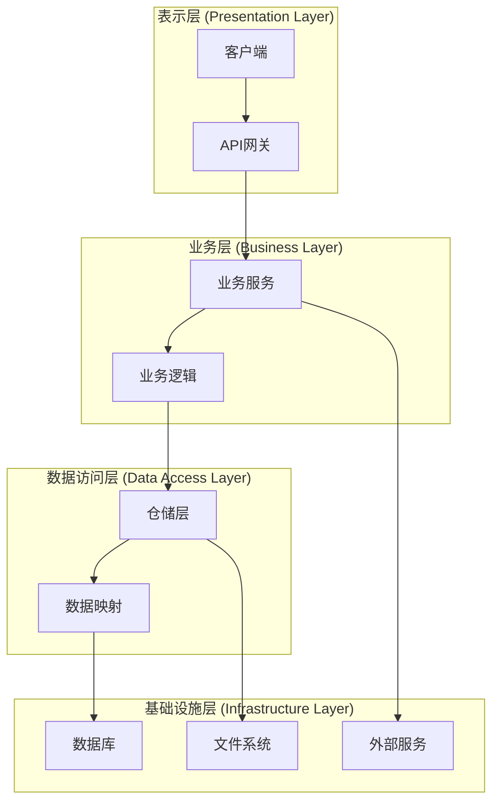
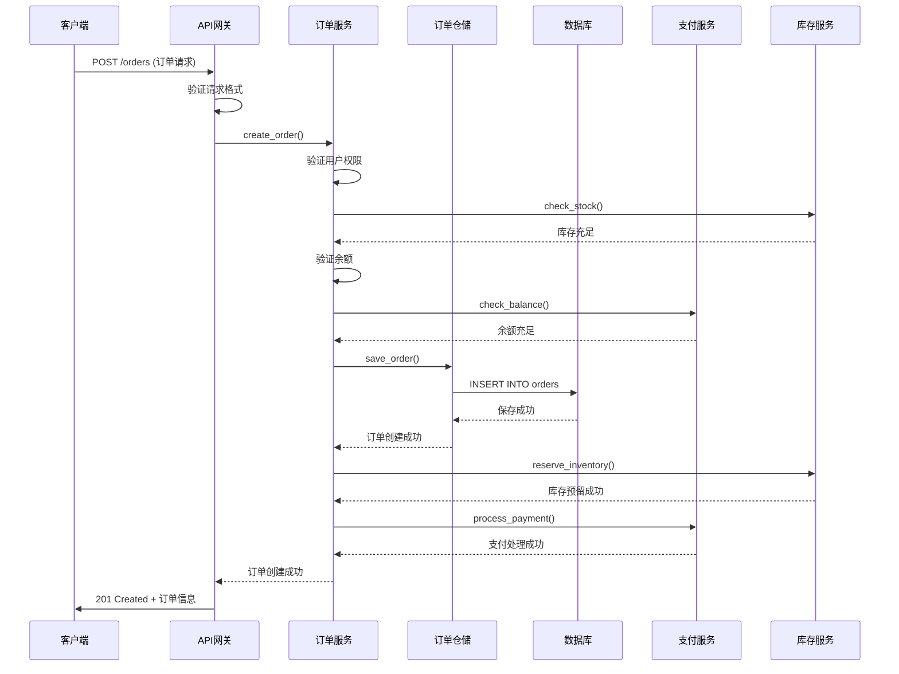
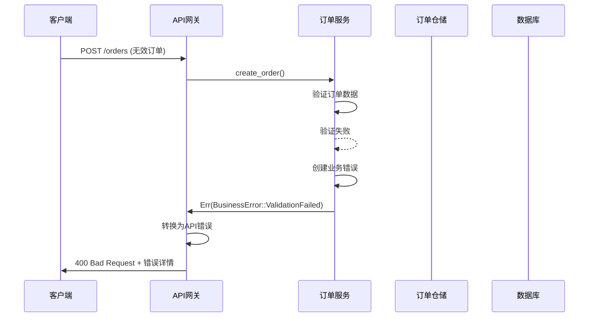
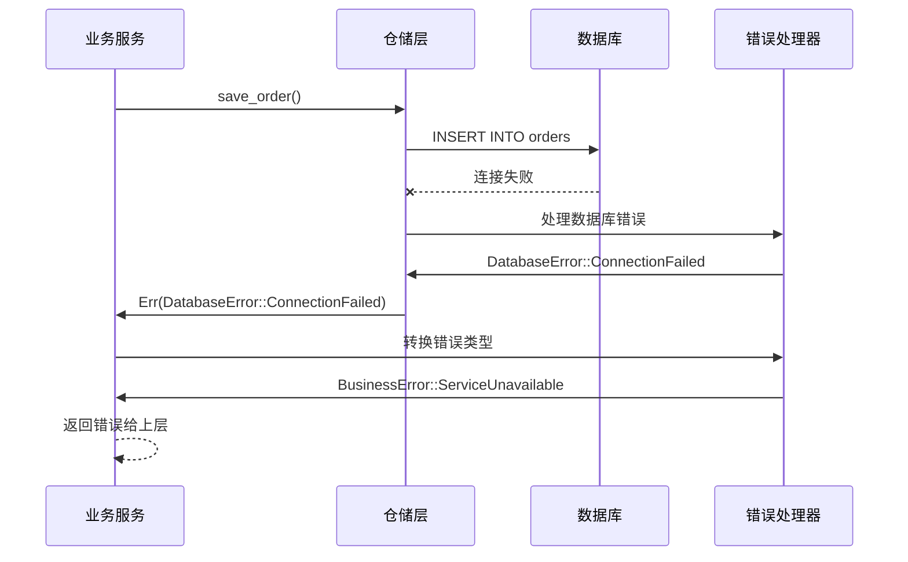

# 错误处理层级

## 概述

错误处理层级定义了错误在系统不同层次间的传播和处理机制。通过分层处理模型，可以实现错误的有效隔离、转换和管理，确保系统在面对各种错误情况时能够保持稳定性和可维护性。

## 分层处理模型

### 层次架构

错误处理系统采用四层架构，每一层都有明确的职责和处理策略：



### 层级职责定义

#### 1. 表示层 (Presentation Layer)

**职责范围：**
- 处理来自客户端的请求和响应
- 进行请求参数验证和格式转换
- 将业务层错误转换为客户端友好的错误信息
- 维护API契约和错误码规范

**错误处理策略：**
```rust
#[derive(Debug, Serialize)]
pub struct ApiError {
    pub code: String,
    pub message: String,
    pub details: Option<serde_json::Value>,
    pub request_id: String,
}

impl ApiError {
    pub fn from_business_error(business_error: BusinessError, request_id: String) -> Self {
        let (code, message) = match business_error {
            BusinessError::ValidationFailed { field, message } => (
                "VALIDATION_ERROR".to_string(),
                format!("{}: {}", field, message),
            ),
            BusinessError::InsufficientBalance { required, available } => (
                "INSUFFICIENT_BALANCE".to_string(),
                format!("余额不足，需要: {}, 可用: {}", required, available),
            ),
            BusinessError::Unauthorized => (
                "UNAUTHORIZED".to_string(),
                "未授权访问".to_string(),
            ),
            BusinessError::NotFound { resource } => (
                "NOT_FOUND".to_string(),
                format!("资源不存在: {}", resource),
            ),
            BusinessError::ServiceUnavailable { service } => (
                "SERVICE_UNAVAILABLE".to_string(),
                format!("服务不可用: {}", service),
            ),
            BusinessError::InternalError { message } => (
                "INTERNAL_ERROR".to_string(),
                "内部服务器错误".to_string(),
            ),
        };
        
        Self {
            code,
            message,
            details: None,
            request_id,
        }
    }
    
    pub fn with_details(mut self, details: serde_json::Value) -> Self {
        self.details = Some(details);
        self
    }
}

// API处理函数示例
pub async fn create_order(
    request: web::Json<CreateOrderRequest>,
    req_info: RequestInfo,
) -> Result<HttpResponse, ApiError> {
    let order_service = OrderService::new();
    
    match order_service.create_order(&request.into_inner()).await {
        Ok(order) => Ok(HttpResponse::Created().json(order)),
        Err(business_error) => {
            let api_error = ApiError::from_business_error(business_error, req_info.request_id);
            
            // 记录错误日志
            log::error!(
                "Order creation failed: {}, request_id: {}",
                api_error.message,
                api_error.request_id
            );
            
            // 根据错误类型返回不同的HTTP状态码
            let status_code = match business_error {
                BusinessError::ValidationFailed { .. } => StatusCode::BAD_REQUEST,
                BusinessError::InsufficientBalance { .. } => StatusCode::BAD_REQUEST,
                BusinessError::Unauthorized => StatusCode::UNAUTHORIZED,
                BusinessError::NotFound { .. } => StatusCode::NOT_FOUND,
                BusinessError::ServiceUnavailable { .. } => StatusCode::SERVICE_UNAVAILABLE,
                BusinessError::InternalError { .. } => StatusCode::INTERNAL_SERVER_ERROR,
            };
            
            Err(api_error)
        }
    }
}
```

#### 2. 业务层 (Business Layer)

**职责范围：**
- 实现核心业务逻辑
- 进行业务规则验证
- 协调多个服务和数据源
- 将底层错误转换为业务错误

**错误处理策略：**
```rust
#[derive(Debug, thiserror::Error)]
pub enum BusinessError {
    #[error("验证失败: {field} - {message}")]
    ValidationFailed { field: String, message: String },
    
    #[error("余额不足，需要: {required}, 可用: {available}")]
    InsufficientBalance { required: f64, available: f64 },
    
    #[error("未授权访问")]
    Unauthorized,
    
    #[error("资源不存在: {resource}")]
    NotFound { resource: String },
    
    #[error("服务不可用: {service}")]
    ServiceUnavailable { service: String },
    
    #[error("内部错误: {message}")]
    InternalError { message: String },
}

impl BusinessError {
    pub fn from_database_error(db_error: DatabaseError) -> Self {
        match db_error {
            DatabaseError::ConnectionFailed => {
                BusinessError::ServiceUnavailable {
                    service: "database".to_string(),
                }
            },
            DatabaseError::RecordNotFound { table, id } => {
                BusinessError::NotFound {
                    resource: format!("{}:{}", table, id),
                }
            },
            DatabaseError::ConstraintViolation { constraint, .. } => {
                BusinessError::ValidationFailed {
                    field: constraint,
                    message: "数据约束违反".to_string(),
                }
            },
            DatabaseError::Timeout => {
                BusinessError::ServiceUnavailable {
                    service: "database".to_string(),
                }
            },
            DatabaseError::Unknown(error) => {
                BusinessError::InternalError {
                    message: format!("数据库错误: {}", error),
                }
            },
        }
    }
    
    pub fn from_external_service_error(service_error: ExternalServiceError) -> Self {
        match service_error {
            ExternalServiceError::Timeout { service } => {
                BusinessError::ServiceUnavailable {
                    service: format!("external_{}", service),
                }
            },
            ExternalServiceError::RateLimited { service } => {
                BusinessError::ServiceUnavailable {
                    service: format!("external_{}", service),
                }
            },
            ExternalServiceError::Unavailable { service } => {
                BusinessError::ServiceUnavailable {
                    service: format!("external_{}", service),
                }
            },
            ExternalServiceError::InvalidResponse { service, message } => {
                BusinessError::InternalError {
                    message: format!("外部服务{}响应无效: {}", service, message),
                }
            },
        }
    }
}

// 业务服务实现
pub struct OrderService {
    order_repository: Arc<dyn OrderRepository>,
    payment_service: Arc<dyn PaymentService>,
    inventory_service: Arc<dyn InventoryService>,
}

impl OrderService {
    pub async fn create_order(&self, request: &CreateOrderRequest) -> Result<Order, BusinessError> {
        // 1. 验证用户权限
        self.validate_user_permissions(&request.user_id).await?;
        
        // 2. 检查库存
        self.check_inventory(&request.items).await?;
        
        // 3. 验证余额
        self.validate_balance(&request.user_id, &request.total_amount).await?;
        
        // 4. 创建订单
        let order = self.create_order_record(request).await?;
        
        // 5. 扣减库存
        if let Err(e) = self.reserve_inventory(&order.id, &request.items).await {
            // 如果扣减库存失败，需要回滚订单
            let _ = self.cancel_order(&order.id).await;
            return Err(e);
        }
        
        // 6. 处理支付
        if let Err(e) = self.process_payment(&order).await {
            // 如果支付失败，需要回滚库存和订单
            let _ = self.release_inventory(&order.id).await;
            let _ = self.cancel_order(&order.id).await;
            return Err(e);
        }
        
        Ok(order)
    }
    
    async fn validate_user_permissions(&self, user_id: &str) -> Result<(), BusinessError> {
        // 调用用户服务验证权限
        // ...
        Ok(())
    }
    
    async fn check_inventory(&self, items: &[OrderItem]) -> Result<(), BusinessError> {
        for item in items {
            match self.inventory_service.check_stock(&item.product_id, item.quantity).await {
                Ok(available) if available < item.quantity => {
                    return Err(BusinessError::InsufficientBalance {
                        required: item.quantity as f64,
                        available: available as f64,
                    });
                },
                Err(e) => return Err(BusinessError::from_external_service_error(e)),
                _ => continue,
            }
        }
        Ok(())
    }
    
    async fn validate_balance(&self, user_id: &str, amount: &f64) -> Result<(), BusinessError> {
        match self.payment_service.check_balance(user_id).await {
            Ok(balance) if balance < *amount => {
                Err(BusinessError::InsufficientBalance {
                    required: *amount,
                    available: balance,
                })
            },
            Err(e) => Err(BusinessError::from_external_service_error(e)),
            _ => Ok(()),
        }
    }
    
    async fn create_order_record(&self, request: &CreateOrderRequest) -> Result<Order, BusinessError> {
        let order = Order::new(request);
        self.order_repository.save(&order).await
            .map_err(BusinessError::from_database_error)?;
        Ok(order)
    }
    
    async fn reserve_inventory(&self, order_id: &str, items: &[OrderItem]) -> Result<(), BusinessError> {
        self.inventory_service.reserve(order_id, items).await
            .map_err(BusinessError::from_external_service_error)
    }
    
    async fn process_payment(&self, order: &Order) -> Result<(), BusinessError> {
        let payment_request = PaymentRequest::from_order(order);
        self.payment_service.process_payment(&payment_request).await
            .map_err(BusinessError::from_external_service_error)
    }
    
    async fn cancel_order(&self, order_id: &str) -> Result<(), BusinessError> {
        self.order_repository.cancel(order_id).await
            .map_err(BusinessError::from_database_error)
    }
    
    async fn release_inventory(&self, order_id: &str) -> Result<(), BusinessError> {
        self.inventory_service.release(order_id).await
            .map_err(BusinessError::from_external_service_error)
    }
}
```

#### 3. 数据访问层 (Data Access Layer)

**职责范围：**
- 封装数据库操作
- 管理数据持久化逻辑
- 处理数据映射和转换
- 提供统一的数据访问接口

**错误处理策略：**
```rust
#[derive(Debug, thiserror::Error)]
pub enum DatabaseError {
    #[error("数据库连接失败")]
    ConnectionFailed,
    
    #[error("数据库操作超时")]
    Timeout,
    
    #[error("记录不存在: {table} - {id}")]
    RecordNotFound { table: String, id: String },
    
    #[error("约束违反: {constraint} in table {table}")]
    ConstraintViolation { constraint: String, table: String },
    
    #[error("数据库错误: {0}")]
    Unknown(String),
}

// 仓储接口定义
#[async_trait::async_trait]
pub trait OrderRepository: Send + Sync {
    async fn save(&self, order: &Order) -> Result<(), DatabaseError>;
    async fn find_by_id(&self, id: &str) -> Result<Option<Order>, DatabaseError>;
    async fn cancel(&self, order_id: &str) -> Result<(), DatabaseError>;
    async fn find_by_user_id(&self, user_id: &str) -> Result<Vec<Order>, DatabaseError>;
}

// 具体实现
pub struct PostgresOrderRepository {
    pool: sqlx::PgPool,
}

impl PostgresOrderRepository {
    pub fn new(pool: sqlx::PgPool) -> Self {
        Self { pool }
    }
    
    async fn execute_with_retry<F, T>(&self, operation: F) -> Result<T, DatabaseError>
    where
        F: Fn() -> Result<T, sqlx::Error>,
    {
        let mut retries = 0;
        let max_retries = 3;
        
        loop {
            match operation() {
                Ok(result) => return Ok(result),
                Err(e) => {
                    retries += 1;
                    if retries > max_retries {
                        return Err(DatabaseError::Unknown(format!("数据库操作失败: {}", e)));
                    }
                    
                    // 检查是否是可重试的错误
                    match &e {
                        sqlx::Error::Database(_) => {
                            tokio::time::sleep(Duration::from_millis(100 * retries)).await;
                            continue;
                        },
                        sqlx::Error::Io(_) => {
                            tokio::time::sleep(Duration::from_millis(100 * retries)).await;
                            continue;
                        },
                        _ => return Err(DatabaseError::Unknown(format!("数据库操作失败: {}", e))),
                    }
                }
            }
        }
    }
}

#[async_trait::async_trait]
impl OrderRepository for PostgresOrderRepository {
    async fn save(&self, order: &Order) -> Result<(), DatabaseError> {
        let query = r#"
            INSERT INTO orders (id, user_id, total_amount, status, created_at, updated_at)
            VALUES ($1, $2, $3, $4, $5, $6)
        "#;
        
        self.execute_with_retry(|| {
            sqlx::query(query)
                .bind(&order.id)
                .bind(&order.user_id)
                .bind(order.total_amount)
                .bind(&order.status.to_string())
                .bind(order.created_at)
                .bind(order.updated_at)
                .execute(&self.pool)
                .await
                .map(|_| ())
                .map_err(|e| {
                    match e {
                        sqlx::Error::Database(db_error) => {
                            if db_error.is_unique_violation() {
                                sqlx::Error::Database(db_error)
                            } else {
                                e
                            }
                        },
                        _ => e,
                    }
                })
        }).await
    }
    
    async fn find_by_id(&self, id: &str) -> Result<Option<Order>, DatabaseError> {
        let query = r#"
            SELECT id, user_id, total_amount, status, created_at, updated_at
            FROM orders
            WHERE id = $1
        "#;
        
        self.execute_with_retry(|| {
            sqlx::query_as::<_, Order>(query)
                .bind(id)
                .fetch_optional(&self.pool)
                .await
                .map_err(|e| match e {
                    sqlx::Error::RowNotFound => {
                        sqlx::Error::RowNotFound
                    },
                    _ => e,
                })
        }).await
        .map_err(|e| {
            if let sqlx::Error::RowNotFound = e {
                DatabaseError::RecordNotFound {
                    table: "orders".to_string(),
                    id: id.to_string(),
                }
            } else {
                DatabaseError::Unknown(format!("查询失败: {}", e))
            }
        })
    }
    
    async fn cancel(&self, order_id: &str) -> Result<(), DatabaseError> {
        let query = r#"
            UPDATE orders 
            SET status = 'cancelled', updated_at = $1
            WHERE id = $2 AND status != 'cancelled'
        "#;
        
        let result = self.execute_with_retry(|| {
            sqlx::query(query)
                .bind(Utc::now())
                .bind(order_id)
                .execute(&self.pool)
                .await
        }).await?;
        
        if result.rows_affected() == 0 {
            return Err(DatabaseError::RecordNotFound {
                table: "orders".to_string(),
                id: order_id.to_string(),
            });
        }
        
        Ok(())
    }
    
    async fn find_by_user_id(&self, user_id: &str) -> Result<Vec<Order>, DatabaseError> {
        let query = r#"
            SELECT id, user_id, total_amount, status, created_at, updated_at
            FROM orders
            WHERE user_id = $1
            ORDER BY created_at DESC
        "#;
        
        self.execute_with_retry(|| {
            sqlx::query_as::<_, Order>(query)
                .bind(user_id)
                .fetch_all(&self.pool)
                .await
        }).await
        .map_err(|e| DatabaseError::Unknown(format!("查询失败: {}", e)))
    }
}
```

#### 4. 基础设施层 (Infrastructure Layer)

**职责范围：**
- 管理数据库连接和池化
- 处理外部服务调用
- 管理文件系统操作
- 提供基础设施服务

**错误处理策略：**
```rust
#[derive(Debug, thiserror::Error)]
pub enum ExternalServiceError {
    #[error("服务超时: {service}")]
    Timeout { service: String },
    
    #[error("服务限流: {service}")]
    RateLimited { service: String },
    
    #[error("服务不可用: {service}")]
    Unavailable { service: String },
    
    #[error("响应无效: {service} - {message}")]
    InvalidResponse { service: String, message: String },
    
    #[error("网络错误: {service} - {message}")]
    NetworkError { service: String, message: String },
}

// HTTP客户端封装
pub struct HttpClient {
    client: reqwest::Client,
    timeout: Duration,
    max_retries: usize,
}

impl HttpClient {
    pub fn new(timeout: Duration, max_retries: usize) -> Self {
        Self {
            client: reqwest::Client::new(),
            timeout,
            max_retries,
        }
    }
    
    pub async fn post<T, R>(&self, url: &str, body: &T) -> Result<R, ExternalServiceError>
    where
        T: Serialize,
        R: for<'de> Deserialize<'de>,
    {
        let mut retries = 0;
        
        loop {
            match self.try_post(url, body).await {
                Ok(result) => return Ok(result),
                Err(e) => {
                    retries += 1;
                    if retries > self.max_retries {
                        return Err(e);
                    }
                    
                    // 检查是否是可重试的错误
                    match &e {
                        ExternalServiceError::Timeout { .. } => {
                            tokio::time::sleep(Duration::from_millis(100 * retries)).await;
                            continue;
                        },
                        ExternalServiceError::NetworkError { .. } => {
                            tokio::time::sleep(Duration::from_millis(100 * retries)).await;
                            continue;
                        },
                        ExternalServiceError::RateLimited { .. } => {
                            tokio::time::sleep(Duration::from_millis(1000 * retries)).await;
                            continue;
                        },
                        _ => return Err(e),
                    }
                }
            }
        }
    }
    
    async fn try_post<T, R>(&self, url: &str, body: &T) -> Result<R, ExternalServiceError>
    where
        T: Serialize,
        R: for<'de> Deserialize<'de>,
    {
        let response = self.client
            .post(url)
            .json(body)
            .timeout(self.timeout)
            .send()
            .await
            .map_err(|e| {
                if e.is_timeout() {
                    ExternalServiceError::Timeout {
                        service: self.extract_service_name(url),
                    }
                } else if e.is_request() {
                    ExternalServiceError::NetworkError {
                        service: self.extract_service_name(url),
                        message: e.to_string(),
                    }
                } else {
                    ExternalServiceError::NetworkError {
                        service: self.extract_service_name(url),
                        message: e.to_string(),
                    }
                }
            })?;
        
        let status = response.status();
        
        if status.is_server_error() {
            return Err(ExternalServiceError::Unavailable {
                service: self.extract_service_name(url),
            });
        }
        
        if status == StatusCode::TOO_MANY_REQUESTS {
            return Err(ExternalServiceError::RateLimited {
                service: self.extract_service_name(url),
            });
        }
        
        if !status.is_success() {
            return Err(ExternalServiceError::InvalidResponse {
                service: self.extract_service_name(url),
                message: format!("HTTP状态码: {}", status),
            });
        }
        
        response.json::<R>().await.map_err(|e| {
            ExternalServiceError::InvalidResponse {
                service: self.extract_service_name(url),
                message: format!("JSON解析失败: {}", e),
            }
        })
    }
    
    fn extract_service_name(&self, url: &str) -> String {
        url.split('/')
            .find(|&part| !part.is_empty())
            .unwrap_or("unknown")
            .to_string()
    }
}

// 数据库连接池管理
pub struct DatabaseManager {
    pool: sqlx::PgPool,
    health_check_interval: Duration,
}

impl DatabaseManager {
    pub async fn new(database_url: &str, max_connections: u32) -> Result<Self, DatabaseError> {
        let pool = sqlx::postgres::PgPoolOptions::new()
            .max_connections(max_connections)
            .connect(database_url)
            .await
            .map_err(|_| DatabaseError::ConnectionFailed)?;
        
        Ok(Self {
            pool,
            health_check_interval: Duration::from_secs(30),
        })
    }
    
    pub fn get_pool(&self) -> &sqlx::PgPool {
        &self.pool
    }
    
    pub async fn health_check(&self) -> bool {
        sqlx::query("SELECT 1")
            .fetch_one(&self.pool)
            .await
            .is_ok()
    }
    
    pub async fn start_health_monitor(&self) {
        let pool = self.pool.clone();
        let interval = self.health_check_interval;
        
        tokio::spawn(async move {
            let mut interval_timer = tokio::time::interval(interval);
            
            loop {
                interval_timer.tick().await;
                
                if !Self::check_pool_health(&pool).await {
                    log::error!("数据库连接池健康检查失败");
                    // 可以在这里触发告警或其他恢复机制
                }
            }
        });
    }
    
    async fn check_pool_health(pool: &sqlx::PgPool) -> bool {
        sqlx::query("SELECT 1")
            .fetch_one(pool)
            .await
            .is_ok()
    }
}
```

## 错误传播序列图

### 订单创建流程



### 错误处理流程



### 数据库错误传播



## 层级间错误转换规范

### 错误转换映射表

| 源层级 | 目标层级 | 源错误类型 | 目标错误类型 | 转换策略 |
|--------|----------|------------|--------------|----------|
| 基础设施层 | 数据访问层 | ConnectionTimeout | DatabaseError::Timeout | 直接映射 |
| 数据访问层 | 业务层 | DatabaseError::RecordNotFound | BusinessError::NotFound | 语义转换 |
| 业务层 | 表示层 | BusinessError::ValidationFailed | ApiError::ValidationError | 信息补充 |
| 业务层 | 表示层 | BusinessError::ServiceUnavailable | ApiError::ServiceUnavailable | 状态码映射 |

### 转换示例代码

```rust
// 基础设施层到数据访问层
impl From<reqwest::Error> for DatabaseError {
    fn from(error: reqwest::Error) -> Self {
        if error.is_timeout() {
            DatabaseError::Timeout
        } else if error.is_connect() {
            DatabaseError::ConnectionFailed
        } else {
            DatabaseError::Unknown(error.to_string())
        }
    }
}

// 数据访问层到业务层
impl From<DatabaseError> for BusinessError {
    fn from(error: DatabaseError) -> Self {
        match error {
            DatabaseError::ConnectionFailed => {
                BusinessError::ServiceUnavailable {
                    service: "database".to_string(),
                }
            },
            DatabaseError::Timeout => {
                BusinessError::ServiceUnavailable {
                    service: "database".to_string(),
                }
            },
            DatabaseError::RecordNotFound { table, id } => {
                BusinessError::NotFound {
                    resource: format!("{}:{}", table, id),
                }
            },
            DatabaseError::ConstraintViolation { constraint, table } => {
                BusinessError::ValidationFailed {
                    field: constraint,
                    message: format!("{}表数据约束违反", table),
                }
            },
            DatabaseError::Unknown(message) => {
                BusinessError::InternalError {
                    message: format!("数据库错误: {}", message),
                }
            },
        }
    }
}

// 业务层到表示层
impl From<BusinessError> for ApiError {
    fn from(error: BusinessError) -> Self {
        let (code, message, status_code) = match error {
            BusinessError::ValidationFailed { field, message } => (
                "VALIDATION_ERROR".to_string(),
                format!("{}: {}", field, message),
                StatusCode::BAD_REQUEST,
            ),
            BusinessError::InsufficientBalance { required, available } => (
                "INSUFFICIENT_BALANCE".to_string(),
                format!("余额不足，需要: {}, 可用: {}", required, available),
                StatusCode::BAD_REQUEST,
            ),
            BusinessError::Unauthorized => (
                "UNAUTHORIZED".to_string(),
                "未授权访问".to_string(),
                StatusCode::UNAUTHORIZED,
            ),
            BusinessError::NotFound { resource } => (
                "NOT_FOUND".to_string(),
                format!("资源不存在: {}", resource),
                StatusCode::NOT_FOUND,
            ),
            BusinessError::ServiceUnavailable { service } => (
                "SERVICE_UNAVAILABLE".to_string(),
                format!("服务不可用: {}", service),
                StatusCode::SERVICE_UNAVAILABLE,
            ),
            BusinessError::InternalError { message } => (
                "INTERNAL_ERROR".to_string(),
                "内部服务器错误".to_string(),
                StatusCode::INTERNAL_SERVER_ERROR,
            ),
        };
        
        Self {
            code,
            message,
            details: None,
            request_id: generate_request_id(),
        }
    }
}
```

## 最佳实践

### 层级设计原则

1. **单一职责**: 每一层只处理属于自己职责范围内的错误
2. **错误隔离**: 下层错误不应直接传播到上层，需要进行适当转换
3. **语义保持**: 错误转换过程中要保持原始错误的语义信息
4. **上下文丰富**: 在错误传播过程中逐步添加相关的上下文信息

### 错误处理最佳实践

1. **及早处理**: 在最合适的层级处理错误，避免错误过度传播
2. **记录日志**: 在每一层都记录错误日志，便于问题排查
3. **用户友好**: 表示层错误信息要对用户友好，避免暴露技术细节
4. **监控告警**: 建立完善的错误监控和告警机制

### 性能考虑

1. **避免过度包装**: 不要为每个错误创建过深的包装层次
2. **异步处理**: 对于非关键路径的错误，可以异步处理
3. **资源清理**: 确保错误发生时能够正确清理资源
4. **重试策略**: 对于临时性错误，实现合理的重试机制

## 相关文档

- [错误分类体系](./01-error-classification.md) - 不同类型错误的分类方法
- [错误处理策略](./02-handling-strategies.md) - 不同类型错误的处理策略
- [错误归集机制](./03-error-aggregation.md) - 跨层错误转换方法
- [错误日志规范](./05-logging-standards.md) - 标准化错误日志字段格式