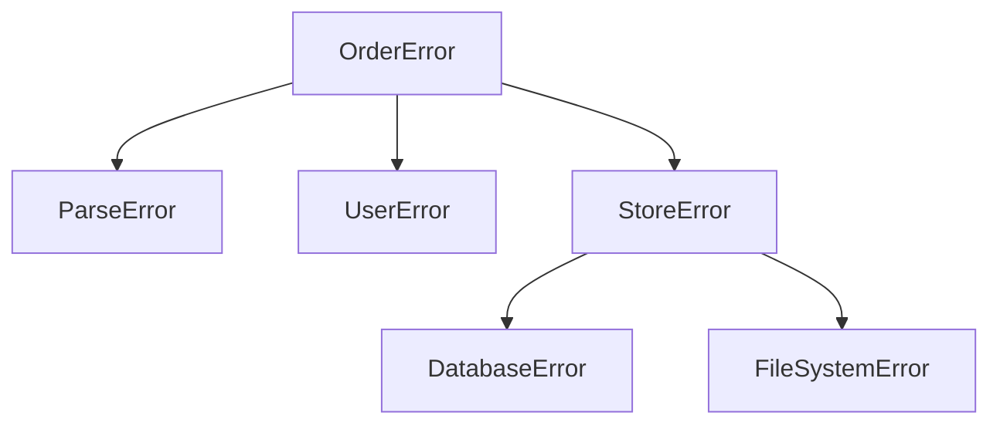
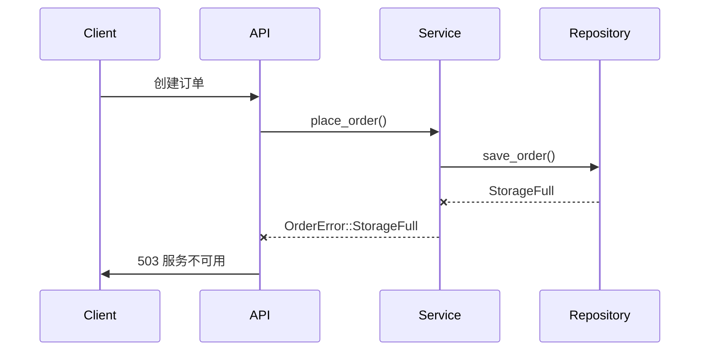

# error-design

## 错误处理设计

### 错误分类体系

#### 1. 按错误性质分类
| 类型         | 特征                           | 示例                     | 处理策略       |
|--------------|--------------------------------|--------------------------|----------------|
| **业务错误** | 由业务规则触发的明确错误       | 余额不足、订单格式错误   | 直接返回客户端 |
| **系统错误** | 系统内部状态异常               | 数据库连接失败、内存不足 | 告警并降级处理 |
| **依赖错误** | 第三方服务或基础设施错误       | 支付网关超时             | 重试机制       |
| **逻辑错误** | 程序逻辑缺陷导致的不可恢复错误 | 空指针异常               | 立即终止       |

#### 2. 按错误层级分类


### 错误处理策略

#### 策略矩阵
| 策略        | 适用场景                     | 实现方式                      | 示例                     |
|-------------|----------------------------|-----------------------------|--------------------------|
| **向上抛出** | 当前层无法处理的错误        | `ErrConv` trait 转换错误类型 | 存储错误转业务错误       |
| **重试**     | 临时性故障                  | `retry` 宏包裹操作           | 数据库连接失败自动重连   |
| **降级**     | 非关键路径失败              | 返回默认值                   | 推荐服务失败返回空列表   |
| **熔断**     | 持续错误避免系统崩溃        | 断路器模式                   | 连续支付失败停止交易     |

### 错误归集机制

#### 跨层错误转换
```rust
impl From<StoreReason> for StructReason<OrderReason> {
    fn from(value: StoreReason) -> Self {
        match value {
            StoreReason::StorageFull =>
                StructReason::from(UvsReason::from_sys("sys fail"))
        }
    }
}
```

#### 错误上下文保留
```rust
fn place_order() -> Result<Order> {
    let mut ctx = WithContext::want("place_order");
    ctx.with(order_txt);

    parse_order()
        .want("解析订单")
        .with(&ctx)  // 绑定上下文
        .owe_biz()?;
}
```

### 错误处理层级

#### 分层处理模型


### 错误日志规范

#### 日志字段标准
```rust
#[derive(StructError)]
pub struct OrderError {
    pub trace_id: String,      // 全链路追踪ID
    pub timestamp: DateTime,   // 错误发生时间
    pub code: i32,             // 错误代码
    pub message: String,       // 可读错误信息
    pub detail: String,        // 技术细节
    pub context: Value,        // 业务上下文
    pub root_cause: String,    // 根因错误
}
```

### 最佳实践指南

1. **上下文丰富化**
   ```rust
   err.with_detail(format!("当前余额：{}，需要：{}", balance, amount))
      .with_tag("critical")
      .with_metric("order_failure", 1.0)
   ```

2. **错误转换规范**
   ```rust
   // Good: 保留原始错误信息
   .map_err(|e| OrderError::from(e).keep_source())

   // Bad: 丢失错误上下文
   .map_err(|_| OrderError::new("error"))
   ```

3. **敏感信息过滤**
   ```rust
   impl Display for PaymentError {
       fn fmt(&self, f: &mut Formatter) -> Result {
           // 屏蔽信用卡号
           write!(f, "{}", self.message.replace(regex!(r"\d{4}-\d{4}-\d{4}"), "****"))
       }
   }
   ```

### 监控指标体系

| 指标名称               | 类型       | 标签                     | 告警阈值       |
|------------------------|------------|--------------------------|----------------|
| order_failure_total    | Counter    | reason, service          | 每分钟>100     |
| storage_usage          | Gauge      | host, db                 | >90%           |
| http_client_errors     | Histogram  | status_code, endpoint    | p95>500ms      |

### 错误恢复模式

```rust
impl OrderService {
    pub fn place_order_with_retry(/* ... */) -> Result<Order> {
        retry!(
            max_retries = 3,
            backoff = Exponential::new(Duration::from_secs(1)),
            condition = |e: &OrderError| e.is_retryable()
        ) {
            Self::place_order(user_id, amount, order_txt)
        }
    }
}
```

该设计文档与示例代码形成完整闭环，通过：
1. 领域错误定义 → 对应错误分类体系
2. 错误转换实现 → 对应错误归集机制
3. WithContext 使用 → 对应上下文规范
4. print_error 展示 → 对应日志标准
实现从设计到落地的完整错误处理方案。
